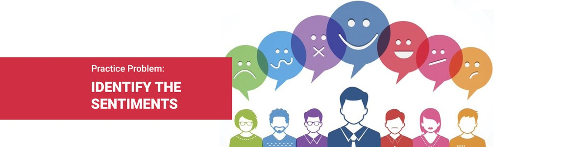

# Linguipedia NLP

## Problem Statement

**Identify the Sentiments**
Sentiment analysis remains one of the key problems that has seen extensive application of natural language processing. This time around, given the tweets from customers about various tech firms who manufacture and sell mobiles, computers, laptops, etc, the task is to identify if the tweets have a negative sentiment towards such companies or products.

## Data Description
**train.csv** - For training the models, we provide a labelled dataset of 7920 tweets. The dataset is provided in the form of a csv file with each line storing a tweet id, its label and the tweet.

**test.csv** - The test data file contains only tweet ids and the tweet text with each tweet in a new line.

**sample_submission.csv** - The exact format for a valid submission

Most profane and vulgar terms in the tweets have been replaced with “$&@*#”. However, please note that the dataset still might contain text that may be considered profane, vulgar, or offensive.

## Evaluation Metric
The submitted output will be evaluated by the **F1-Score**

## Competition [Link](https://datahack.analyticsvidhya.com/contest/linguipedia-codefest-natural-language-processing-1/)
